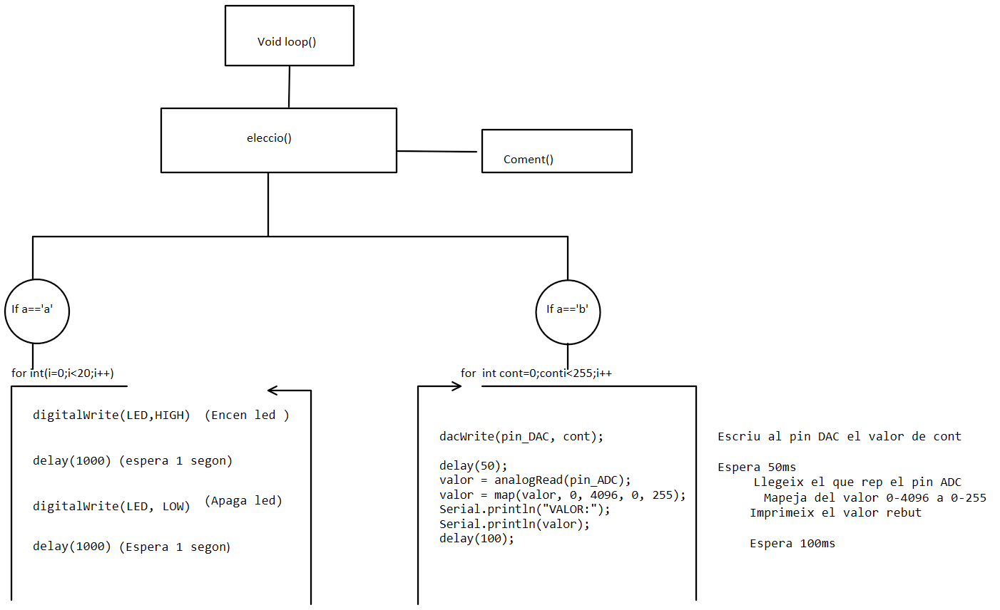
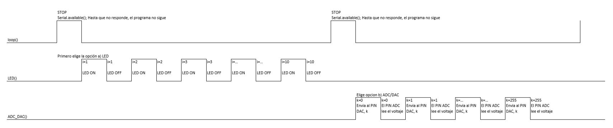

# PRACTICA 1 ALBERT CAMBRAS :  BLINK, ADC/DAC

Para hacer el código más interactivo y así también aprender, he hecho un menú de opciones para poder elegir entre el modo LED o el modo ADC/DAC.

Cuando subimos el código a la placa ESP32 tenemos que abrir el monitor donde aparecerá el menú de opciones.
(Si por alguna razón no apareciera este, pulsa el botón RESET).

Toda la informació recibida tanto por la placa como para el usuario, irá enviada por el puerto Serial, un puerto que efectúa la comunicación entre el ordenador y la placa, en este caso la ESP32.


Para empezar, en el void setup() he declarado el led como una salida, he inicializado el puerto serie y he establecido la resolución del convertidor a 12 bits, más tarde comentaré los problemas que he tenido con la resolución.

### void setup()

```cs

void setup() {
  Serial.begin(9600);
  pinMode(LED,OUTPUT);
  analogReadResolution(12); // NO CAL JA QUE VE PER DEFECTE
}

```

En el loop lo único que llamo es a la función eleccio() que será la siguiente en explicar.

### void loop()
``` cs

void loop() {
  delay(100);
  eleccio();
}

```

Empezaré explicando la funcion 'elecció' donde está situado nuestro menú.

### FUNCIÓN ELECCIÓ
```cs
void eleccio(){
  char a;
  int b=0;
  if (Serial.available()){
    if(b==0){
      coments();
      a=Serial.read();
      }
    //coments();
    if(a=='a'){
      b=1;
      led();
      coments();
      a=Serial.read();
    }
    else if(a=='b'){
      b=1;
      adc_dac();
      coments();
      a=Serial.read();

    }
  }
}

```
Para esta función he usado 'Serial.available()' que finaliza solo cuando recibe los datos. Para entender esos datos recibidos, usamos Serial.read() que nos leerá los datos de entrada.
Si recibe un carácter 'a' nos iremos al modo LED y si ingresamos un carácter 'b' iremos al modo ADC/DAC.


He creado otra función para que el menú quede ordenado donde en esta irá situada la información sobre las elecciones que se pueden tomar en mi programa. Esta la he llamado coments().

``` cs
void coments(){
    Serial.println("a. LED");
    Serial.println("b. ADC");
}

```


La siguiente función es void LED() que se encargará de encender y apagar el LED durante 20 segundos. A la vez que nos envía por el puerto serie cuando este está apagado o encendido.

### FUNCIÓN LED

``` cs
void led(){
  for(int i=0;i<10;i++){
    digitalWrite(LED,HIGH);
    Serial.println("ON");
    delay(500);
    digitalWrite(LED,LOW);
    Serial.println("OFF");
    delay(500);
  }
}

```

Por último, tenemos la función void ADC_DAC.
Para esta función tenemos que conectar mediante un cable el pin 25 con el 34.
El pin 25 se puede utilitzar para convertir de digital a analógico y el 34 de analógico a digital.
Lo que he hecho es un bucle donde tenemos una variable count que irá de 0 a 255.
Este valor es el que irá sacando por el pin 25 de manera analógica es decir dará voltajes de 0 a 3.3V con la función dacWrite().
Este voltaje será recibido por el pin 34 y convertirá el voltaje ingresado a digital de 0 a 255 mediante analogRead().
Si fuera bien tendríamos que apreciar que la  variable count coincide con el valor digital del pin 34.
Me encontré con que el valor no coincidía y acabé llegando a la conclusión que era por la resolución del conversor.

Así que usé una función que viene incluida en el entorno Arduino llamada map() que ya había usado anteriormente en algún proyecto.
Esta función lo que hace es convertir una serie de números dentro de un rango a otro.
Por ejemplo si tenemos una serie de números que van de 0-4098, podríamos usar esta función para que nos modifique el valor de este rango a 0-255. Es precisamente lo que he hecho porque he puesto la resolución del convertidor a 12 bits, lo cuál imprimirá valores de 0 a 2^12(4098) y me interesaba que el rango coincidiera con el número que entregaba a la salida digital-analógico, es decir 0-2^9(255).

### FUNCIÓN ADC/DAC

``` cs 
void adc_dac(){

  int valor=0;
 
      for (int cont= 0; cont < 256; cont++){
        dacWrite(pin_DAC, cont);
        delay(50);
        valor = analogRead(pin_ADC);
        valor = map(valor, 0, 4096, 0, 255); // EL MAXIM QUE OBTINDRE AL LLEGIR SERA 4096 (2^12), AIXÍ QUE ARA EL 4096 SERÀ 255;
        Serial.println("VALOR:");
        Serial.println(valor);
        delay(100);
      }
  
}

```


### git hub link
[github_AlbertCambras](https://github.com/AlbertCambras)


### DIAGRAMA DE FLUJO



### DIAGRAMA DE TIEMPOS
